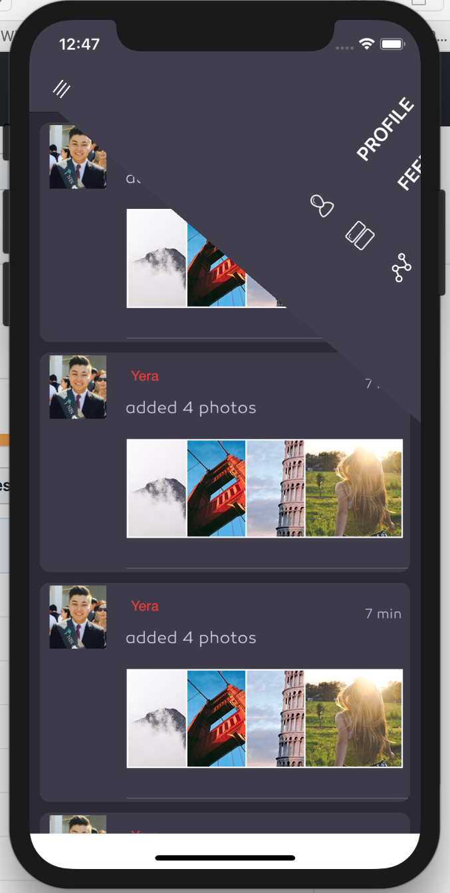
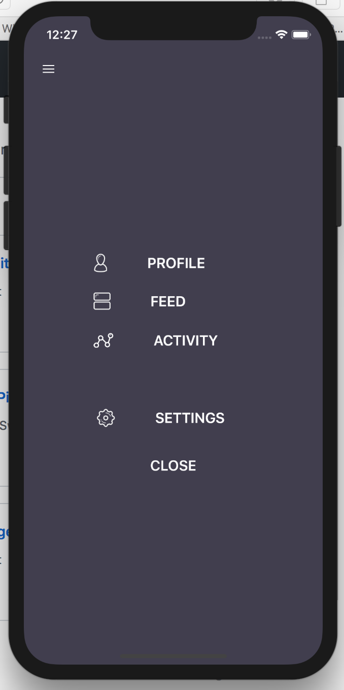

# Guillotine Menu

<p align="center">

</p>
<h2>
<p align="center">

</p>

## Requirements

- iOS 8.0+
- Xcode 9
- Swift 4

## Installation

#### [CocoaPods](http://cocoapods.org)

```ruby
pod 'GuillotineMenu', '~> 3.0'
```

